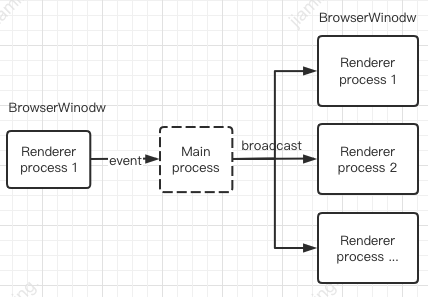

## electron-wpc

该工具库基于 EventEmitter+Promise，实现 electron 窗口与窗口间、窗口与主进程间、窗口广播消息等便捷化通信。
> 如果觉得有帮助欢迎点个⭐，同时也欢迎提出issue。[electron-wpc >>](https://github.com/zhujiaming/electron-wpc)
## 安装

```powershell
npm install electron-wpc
```

## 功能

1. EventEmitter+Promise 方式实现渲染进程与主进程间的消息通信

   

2. EventEmitter+Promise 方式实现两个窗口间的 renderer 进程间的消息通信；

   > a. 支持多对一的半双工消息通信。\
   >  b. 基于 EventEmitter+Promise 特性实现窗口间消息的发送及结果主动返回；\
   >  c. 消息处理者（Provider Renderer）可主动向发送者（Resolver Renderer）抛出异常。\
   >  d. 支持消息的超时处理。\
   >  e. 集成简单。

   

3. EventEmitter+Promise 方式实现多窗口广播通信；

   > a.支持一对多的单工消息通信。\
   >  b.支持广播成功或失败的消息回调。\
   >  c.支持广播前在 main 进程中对数据加工。\
   >  c.集成简单。

   

## 使用示例

> 示例中的执行过程及结果在窗口控制台中打印。

```powershell
npm install
npm run example
```

## 集成与应用

### ① 渲染进程与主进程通过 EventEmitter+Promise 方式进行消息通信

1. main 进程中，待 BrowserWindow 初始化完成，使用 WPCMainRendererConn 对象注册监听者

```javascript
const { WPCMainRendererConn } = require("electron-wpc");
var mainRendererConn = new WPCMainRendererConn();
// 绑定窗口
mainRendererConn.bindWindow(win2);
// 注册事件
mainRendererConn.on("event_getTime", (resolve, rejcet, arg) => {
  console.log("mainRendererConn arg:", arg);
  try {
    setTimeout(() => {
      resolve(`现在时间：${Date.now()}`);
    }, 1000);
  } catch (e) {
    reject(e);
  }
});
```

2. renderer 进程中

```javascript
var rendererConnect = new WPCMainRendererConn();
rendererConnect.setTimeOut(3000); //设置超时时间（默认5s)
function sendToMain() {
  console.log("send to main process");
  rendererConnect
    .send("event_getTime", "getTimeArg")
    .then((retFromMain) => {
      console.log("main process result:", retFromMain);
    })
    .catch((e) => {
      console.error("main process error:", e);
    });
}
```

### ② 双窗口间(renderer 进程)消息发送及处理结果的获取:

1. 在 main 进程中注册 Provider Window（作为内容提供者），并绑定 TAG。(单个窗口可根据作用类型不同设置不同的 tag)

```javascript
const {
  registProviderWindow,
  unRegistProviderWindow,
} = require("electron-wpc");
//...
const winProvider = new BrowserWindow();
const TAG = "tag_for_win_provider";
//...
registProviderWindow(winProvider, TAG);
//...销毁
winProvider.on("close", () => {
  unRegistProviderWindow(TAG);
});
```

2. 在 Provider Window 的 Renderer 进程中，注册相应的监听事件。

```javascript
const { WPCProviderDelegate } = require("electron-wpc");
const providerDelegate = new WPCProviderDelegate();

//example :更新用户表的任务
providerDelegate.on("update_user_table", (resolve, reject, args) => {
  //模拟耗时操作
  setTimeout(() => {
    const replyArgs = { result: `update user id:${args.id} success!` };
    resolve(replyArgs);
  }, 1000);
});
```

3. 在 resolver Window 的 Renderer 进程中，在相应业务逻辑处发送消息，等待执行结果。

```javascript
const { WPCResolverDelegate } = require("electron-wpc");
const TAG = "tag_for_win_provider"; //需填入目标Provider的tagId.
const resolverDelegate = new WPCResolverDelegate(TAG); //这里需要传入tag以指定Provider
// （可选）可设置超时时间，如果超时时间内没有返回结果，则将catch timeout error.
resolverDelegate.setTimeOut(6 * 1000); //default is 5s.
//发送消息
resolverDelegate
  .send("update_user_table")
  .then((res) => {
    //结果返回
    console.log("<-update_user_table res", res);
  })
  .catch((e) => {
    //处理失败
    console.error("<-receive error msg:", e);
  });
```

### ③ 广播通信

1. 在 main 进程注册广播通信事件 id

```javascript
const {
  registBrodcastTransfer,
  unRegistBrodcastTransfer,
} = require("electron-wpc");
//注册多窗口接收广播
registBrodcastTransfer("broadcast_key1");

//如消息数据需要在main进程处理，则可对数据进行加工
registBrodcastTransfer("broadcast_key2", (resolve, reject, args) => {
  // 对args进行加工
  args.id = args.id + "xxx";
  resolve(args);
});

//...销毁
app.on("close", () => {
  unRegistBrodcastTransfer("broadcast_key1", "broadcast_key2");
});
```

2. renderer 进程发送广播至其他所有 renderer 进程

```javascript
ipcRenderer.send("broadcast_key1", { id: 666 });

ipcRenderer.send("broadcast_key2", "abcd");
// （可选）监听广播发送的结果。(需要在原key的基础上添加-reply作为新key)
ipcRenderer.once("broadcast_key2" + "-reply", (e, a) => {
  console.log("=>send broadcast result:", a);
});
```

3. renderer 进程注册广播接收者

```javascript
function exampleBroadcastReceiver() {
  ipcRenderer.on("broadcast_key1", (event, args) => {
    console.log("接收到其他窗口的广播1:", args);
  });

  ipcRenderer.on("broadcast_key2", (event, args) => {
    console.log("接收到其他窗口的广播2:", args);
  });
}
```